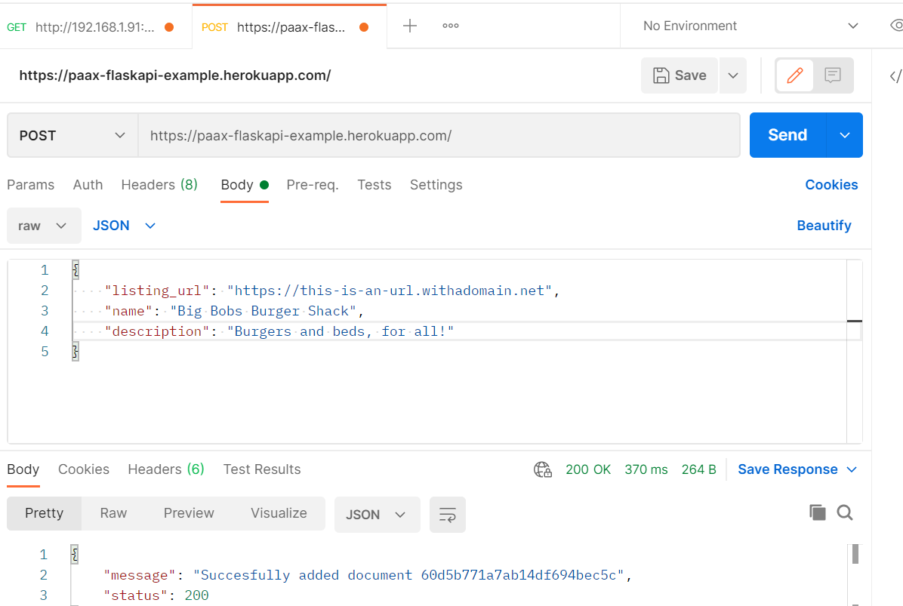
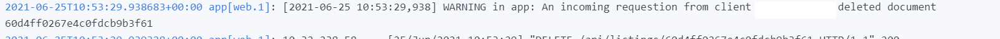

# A Flask REST-API example

A small example of writing a REST-API, plugged into a cloud MongoDB and logging events to the heroku CLI.

## 1) Design

This exercise uses the MongoDB sample database "sample_airbnb", a collection of ~5.6k documents. The API allows the standard CRUD operations to be performed against this collection of documents and this documentation will cover the various available endpoints and their design.

## 1.1) Endpoints


The API has the following endpoints:

* "/" - Root URL. Allowed methods: GET and POST. GET requests serves a static HTML file with endpoint documentation. POSTs to the root, in an "application/json" format, that contain the key-value pairs "name", "description" and "listing_url" allows the adding of documents to the database. This is a very loose "pseudo-schema", due to time-constraints.

* "/api/<query string>" - Query handler with pagination, allowing the browsing of the database. Accepts a standard query-string argument with two variables. "page_no" is the off-set from the collections start, "docs" is the query-results-per-page, e.g "/api/?page_no=2&docs=10" will return documents 10-20 listed from index 0 of the collection. _(Note: Uses the MongoDB "skip()" method, which is not ideal for larger collections. 5500 documents allows it to be relatively performant and it is quicker to implement. For more details on other options, see app.py comments on line  64.)_

* "/api/listings/<document_id_string>" - Handler for specific document read, update and deletion. Allows methods "GET", "POST" and "DELETE. GET requests retrieves a document whose id field matches the document_id_string URL variable. POST requests updates a document whose id matches the document_id_string variable. DELETE requests removes a document matching the document_id_string. _(A quick note here is that the sample databases data has their _id field tagged as string-type and the PyMongo driver automatically tags new _id entries as the BSON ObjectID type. Querying ObjectID by string without changing its type to ObjetID will cause a false error 404 There is therefor an error-handling try/catch block on line 114 that acts as a sanity check, validating input strings as either valid BSON or as string _id values before continuing queries.)_

## 1.2)  Logging strategy



Using the [Flask logging documentation](https://flask.palletsprojects.com/en/2.0.x/logging/) and some notes on Stack Overflow on how to translate this into gunicorn, for deployment onto Heroku, I designed the logging strategy as follows:

* "Create" and "Read" log at the level of "Info", logs always include document IDs to make searching the logs easier in case of debugging. As create and read operations are fairly standard, these do not need to be raised in scope beyond "Info" in the log.
* "Update" and "Delete" log at the level of "Warning", logs always include the IP the request was sent from as well as the ID of the document that has been changed, in order to provide easy-searching
through the looks when required..

# 2) Installation

Irregardless of the method or OS of installing the application, you will need to provide the following environment variables. If running locally, one can easily add a simple file named "env.py" in the project root folder, where you import the "os" core Python model and set environment variables as follows in this example:

```
import os

os.environ["MONGO_URI"] = "mongodb+srv//username:password@server"
os.environ["PORT"] = "7500"

``` 

_The following environment variables are required to run the project_

MONGO_URI = A string value containing a valid MongoDB connection string, whether local or cloud-operated. This database should have been loaded with the MongoDB sample data, for more information [visit this link](https://docs.atlas.mongodb.com/sample-data/available-sample-datasets/)
DEVELOPMENT = A string value, by default set to "true" if you want werkzeug debug activated. If omitted or set to "None", werkzeug debug is inactivated, which is recommended for production.

PORT = A string value, containing the port on which the Flask app is to be served.

_Optional config variables_:

IP = The IP address to be served, may be set to 0.0.0.0 as a config variable on Heroku to avoid build-errors.

## 2.1) Local installation

* 1) Clone this git repository alternatively download and unzip it.

* 2) Open your IDE and a terminal, create a standard Python virtual environment using your prefered method (Eg: python -m venv env). Activate the environment.

* 3) Execute the command "pip install -r requirements.txt" to install all dependencies.

* 4) To run the application locally, run the command "py app.py2 (Note: Windows. For other OSs such as Linux and MacOS, use your local python command e.g "python3" for debian-linux)
 
## 2.2) Heroku

This application comes with a Procfile for deploying to Heroku. Please note that the Heroku Procfile-deployment runs using the Flask dev-server and not a production-grade WSGI gunicorn setup, due to time-constraints. There are multiple ways of deploying to Heroku directly from Github, 
whether through the Heroku CLI tool or the GUI available at the heroku console. 

In the interest of brevity, I will instruct users to follow the steps in the [following link](https://devcenter.heroku.com/articles/getting-started-with-python)

## 2.3) "Cloud"/VPS (e.g. DigitalOcean)

I will direct users looking to deploy a version to DigitalOcean or other Linux based VPS services to [this link](https://www.digitalocean.com/community/tutorials/how-to-deploy-a-flask-application-on-an-ubuntu-vps), in order to find excellent instructions on how to configure a production-worthy WSGI-server for a Flask app.

# 3) Considerations for improvement

## 3.1) Adding WSGI server support

Had I had the time, I would have added a WSGI file and configured Gunicorn for the live version of the application, in order to provide a proper production-grade WSGI server. This was outside the scope of the project, but for any Python http/https server, the local dev-server is not an ideal production environment. 

## 3.2) Aggregate $set "_id" field as ObjectId OR String for the collection

As I was working with sample data and not schema I had defined myself, I ran into some incongruitites with the field-types (See 1.1 for the "api/listings" endpoint) - MongoDBs greatest strength, its schemaless-nature, can become troublesome for developers inheriting a dataset with type-issues occuring if the _id field is not typed as a bson ObjectID. 

A better solution would have been to enforce a proper schema for the _id field by bulk-updating the collection, but for now try/catch block handling prevents needless errors.

## 3.3) Document schema-design

While MongoDBs schemaless-design saves a great deal of development time in Python,
by allowing the straight translation of dicts > bson, enforcing a schema allows for predictable responses on all collections. For future development, one might consider adding an ODM along the lines of MongoEngine to produce a fixed schema for the API, instead of the current example-CRUD that simply validates three fields as present.